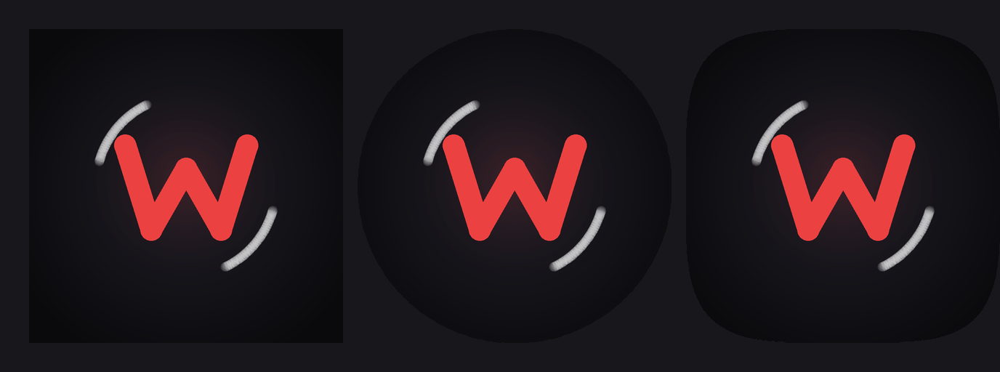

<div align="center">



# NetMusicLite

**一个为 Wear OS 手表打造的网易云音乐客户端 — 把歌单戴在手腕上**

[](https://github.com/windzhou999/WMusic-Release/releases/latest)
[](https://www.android.com/wear/)
[](https://github.com/windzhou999/WMusic-Release/releases/latest)

</div>

---

## 特性

- **手表端网易云播放** — 抬腕即听，无需掏出手机
- **封面取色 + 轻玻璃质感 UI** — 跟随专辑封面动态取色的表盘级界面
- **手势操作** — 触点缩放、主页右滑退出、原路返回
- **听歌识曲** — 集成网易 AFP 音频指纹引擎
- **发音按钮适配** — 歌词注音更友好
- **流畅度优化** — AOT 编译 + Baseline Profile，手表上也能丝滑

## 下载安装

> 最新版本请前往 [**Releases**](https://github.com/windzhou999/WMusic-Release/releases/latest) 页面下载 APK。

**方式一：adb 安装（推荐）**

```bash
adb install -r netmusiclite-1.0.6.apk
```

**方式二：手表本地安装**

将 APK 传入手表存储，用文件管理器打开安装（需允许"安装未知应用"）。

## 应用内更新通道

本仓库根目录的 `update.json` 是 NetMusicLite 的版本清单（事实来源）。自 v1.0.5 起，应用内入口 **设置 → 关于应用 → 检查更新** 会拉取该清单，对比 `versionCode` 后弹窗提示，下载完成并校验 SHA-256 后自动拉起系统安装器。

清单地址：

- **主源**：`https://raw.githubusercontent.com/windzhou999/WMusic-Release/main/update.json`
- **CDN 镜像**：`https://cdn.jsdelivr.net/gh/windzhou999/WMusic-Release@main/update.json`

## 更新日志

| 版本 | 更新内容 |
|------|----------|
| **v1.0.6** | 首次登录使用向导；登录二维码加大 20%；修复向导页按钮裁切；应用改名 netmusiclite |
| **v1.0.5** | 关于应用页新增「检查更新」；接入 GitHub 远程更新通道 |
| **v1.0.4** | 更多残留修复；发音按钮适配 |
| **v1.0.3** | 触点缩放；主页右滑退出；原路返回 |
| **v1.0.2** | 关于应用页 + 封面取色；去系统壁纸取色；轻玻璃风格 + 启动图标 + 改名 |

## 反馈

使用中遇到问题或想要新功能，欢迎到 [Issues](https://github.com/windzhou999/WMusic-Release/issues) 提交。

## 免责声明

- 本项目为**非官方**第三方客户端，仅供个人学习与交流使用，请于下载后 24 小时内自行斟酌保留
- 应用内音乐内容及相关版权归网易云音乐及内容权利方所有
- 本仓库仅发布构建产物（APK）与版本清单，**不含源码**
- 如有侵权，请联系删除

---

<div align="center">

**NetMusicLite** · Made with ❤️ for your wrist

</div>
